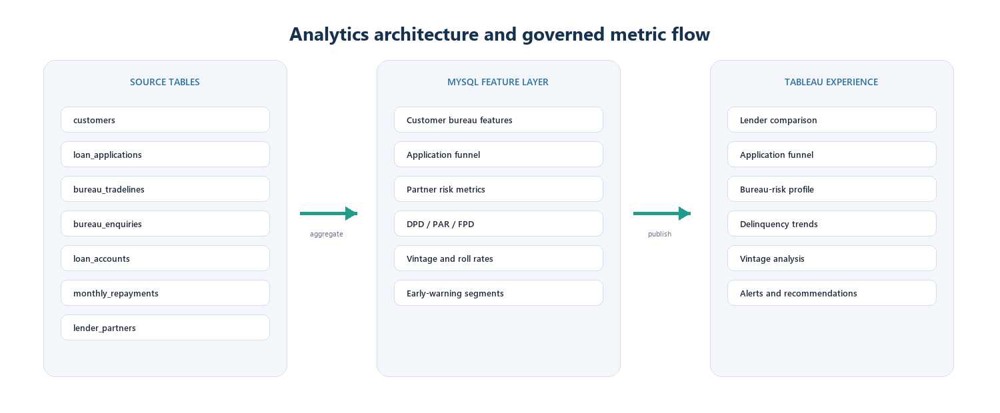
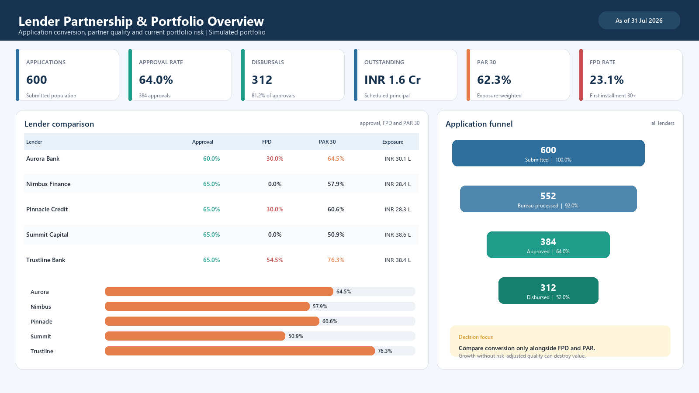
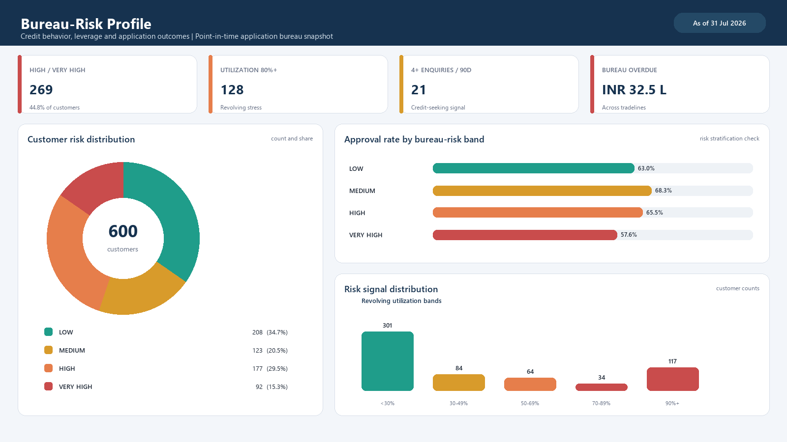
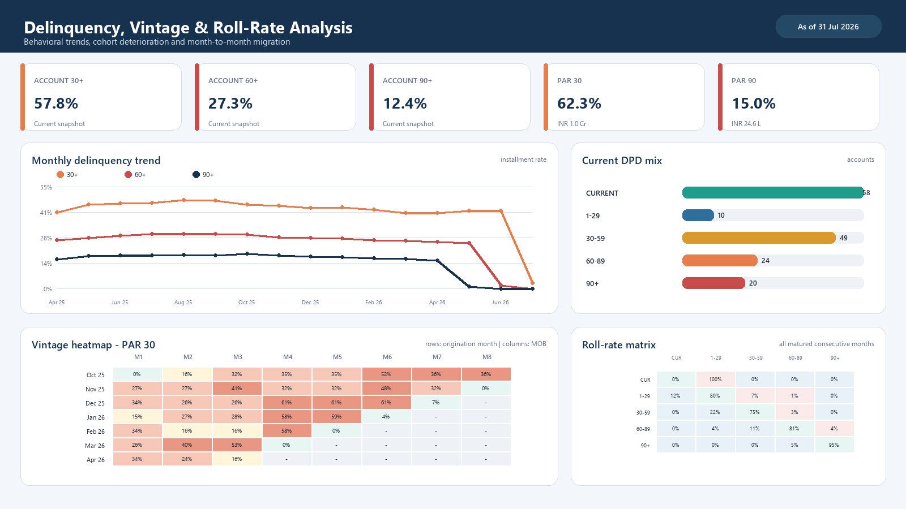
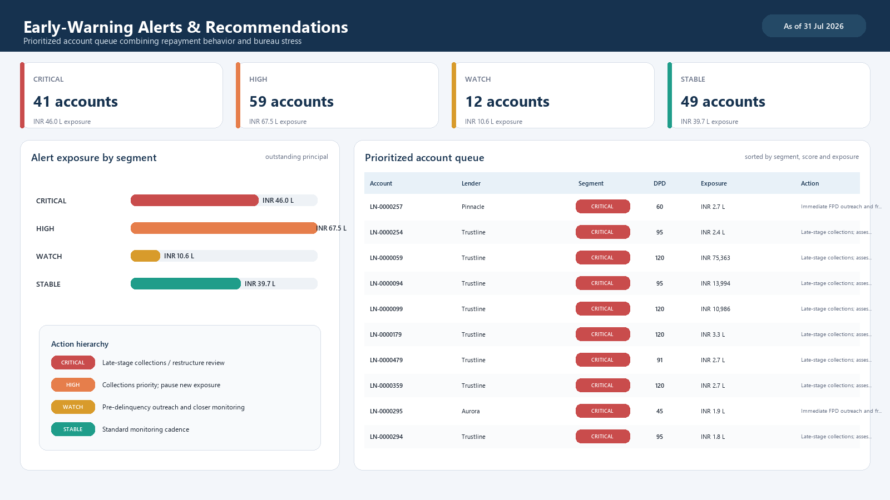

<div align="center">

# LendGuard

### Digital Lending Risk & Partner Intelligence Studio

A privacy-safe MySQL-to-Tableau case study transformed into an interactive React decision system for originations, bureau risk, portfolio quality and lender governance.


[Live dashboard](https://nandini151003.github.io/digital-lending-risk-studio/) · [Case study](docs/case-study.md) · [Methodology](docs/methodology.md) · [Privacy design](docs/privacy.md)

</div>


## The business question

How can a digital lender grow through external partners without allowing attractive application conversion to hide weak bureau quality, first-payment failure or deteriorating portfolio exposure?

LendGuard connects the application funnel, point-in-time bureau features, lender-partner quality, DPD, PAR, first-payment default, vintage performance, roll rates and a treatment-oriented alert queue.

## Executive answer

- Conversion must be read beside FPD and exposure-weighted PAR.
- First-cycle misses deserve a separate operational path because they may reflect affordability, mandate, onboarding or fraud issues.
- Vintage and roll-rate analysis reveal deterioration earlier than one static PAR metric.
- Early-warning scores create value only when they lead to a clear, human-reviewed action.

## Headline synthetic portfolio

| Measure | Result | Management meaning |
| --- | ---: | --- |
| Applications | 600 | Complete submitted population |
| Approval rate | 64.0% | Conversion baseline |
| Disbursals | 312 | 81.2% of approvals |
| PAR 30 | 62.3% | Exposure at 30+ DPD |
| FPD | 23.1% | First-cycle control point |
| Alerts | 41 critical, 59 high, 12 watch | Differentiated treatment capacity |

Every result is generated from deterministic synthetic data and illustrates the analytical method, not actual lender or customer performance.

## What people can use

- Global lender filter with privacy-mode aliases
- Risk-adjusted lender scorecard and application funnel
- Interactive bureau-risk distribution and utilisation signals
- Monthly 30+, 60+ and 90+ delinquency trend
- Vintage PAR 30 heatmap and roll-rate matrix
- Searchable, segment-filtered early-warning queue
- Human-readable methodology and responsible-use drawer
- Downloadable sanitised insight summary
- Original Tableau visuals from the source case study
- Responsive desktop, tablet and mobile layouts

## Architecture



Seven normalised operational tables feed twelve MySQL analytical views. Each experience consumes the view matching its own grain, which prevents fan-out and double counting.

## Original Tableau story

| Lender comparison | Bureau risk |
| --- | --- |
|  |  |

| Vintage and roll rates | Early-warning action queue |
| --- | --- |
|  |  |

## Complete project files

```text
digital-lending-risk-studio/
├── .github/workflows/          GitHub Pages deployment
├── data/                       Sanitised aggregate data and raw-data boundary
├── docs/                       Case study, methodology, privacy and Tableau guide
├── public/assets/              Original privacy-safe analytical visuals
├── scripts/                    Automated privacy gate
├── sql/
│   ├── 01_schema.sql           Seven tables, keys, checks and indexes
│   ├── 02_seed_demo_data.sql   Deterministic 600-customer generator
│   ├── 03_analytics_views.sql  Twelve decision-oriented views
│   └── 04_quality_checks.sql   Reconciliation and maturity gates
├── src/                        Interactive React application
└── README.md
```

The metadata-scrubbed source document is included at [docs/digital-lending-risk-case-study.docx](docs/digital-lending-risk-case-study.docx).

## Run the React experience

```bash
pnpm install
pnpm dev
```

Create a production build:

```bash
pnpm build
pnpm preview
```

## Reproduce the MySQL analytical layer

Run the files in `sql/` in numerical order on MySQL 8.0 or later. The generator creates the demonstration portfolio without external files.

```bash
mysql -u root -p < sql/01_schema.sql
mysql -u root -p < sql/02_seed_demo_data.sql
mysql -u root -p < sql/03_analytics_views.sql
mysql -u root -p < sql/04_quality_checks.sql
```

## Privacy by design

This repository contains no real customer or lender data. It excludes names, phone numbers, emails, government identifiers, credentials, private extracts and live bureau records. `data/raw/` is ignored by Git, the case-study metadata has been scrubbed and `pnpm check:privacy` scans public text for common secret patterns.

## Responsible-use boundary

This is an analytical portfolio demonstration, not a production credit or collections system. Before real use, an implementation would require bureau consent and permissible-use controls, least-privilege access, ledger reconciliation, temporal validation, fairness and drift testing, outcome monitoring, reason codes and documented human overrides.

## Portfolio narrative

I designed a governed risk cockpit that connects origination conversion with downstream portfolio quality. The analysis separates account incidence from capital exposure, tests first-cycle performance, compares cohorts at the same age and turns interpretable risk signals into a capacity-aware treatment queue. I then rebuilt the Tableau story as an interactive React experience that recruiters and stakeholders can use directly.

## Author

Created by [Nandini Malik](https://github.com/nandini151003), Business Analyst and Data Science graduate focused on business analytics, process improvement and responsible AI.

[LinkedIn](https://www.linkedin.com/in/nandini-malik-384885240) · [GitHub](https://github.com/nandini151003)

## License

Released under the [MIT License](LICENSE).
